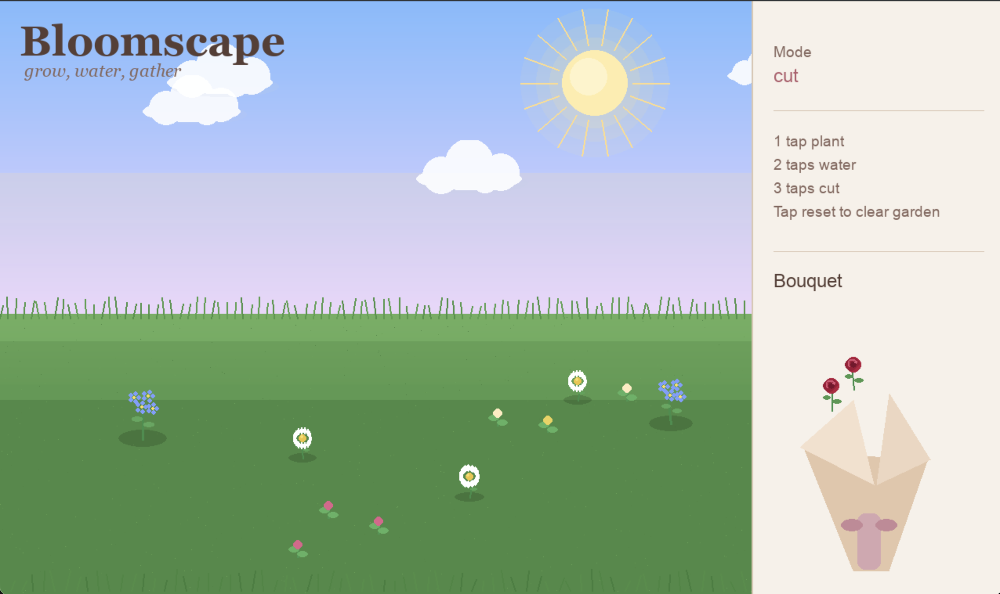

# Bloomscape

Bloomscape is an interactive generative art project that blends physical interaction with a digital garden. Using an ESP32 capacitive touch interface, users can plant, water, and cut flowers in a virtual environment, building a bouquet through real time interaction.

# Demo

[Watch Demo] (https://youtube.com/shorts/uhF6iDYh4nw?feature=share)

 # Visual

# How It Works
- ESP32 capacitive touch sensors detect user interaction
- Touch events are sent via serial communication
- A Python Pygame application renders the virtual garden
- Users interact using physical props:
- Touch pads → plant flowers
- Watering can → grow flowers
- Scissors → cut flowers into a bouquet

Modes are controlled using:

1 tap → Plant
2 taps → Water
3 taps → Cut

# Requirements
Hardware:
- ESP32
- Conductive touch pads (copper tape or foil)
- Wires

Optional props:
- Watering can (wired sensor)
- Scissors (wired sensor)

# Software
- Python 3
- Pygame
- pyserial
- Arduino / PlatformIO for ESP32
- 
# Installation
1. Clone the repo
git clone https://github.com/liz4662/Bloomscape.git
cd Bloomscape
2. Install dependencies
pip install pygame pyserial

If pip does not work:

python3 -m pip install pygame pyserial --break-system-packages

# Setup
Code can be found in the src folder.

- ESP32
Upload the Arduino code in main.cpp to the ESP32
Connect touch pads to:
- Flower pads → T2, T4, T9, T5, etc.
- Mode pad → GPIO 27
- Reset pad → GPIO 33

# Computer
Find your serial port: ls /dev/cu.*
Update in display.py: PORT = "/dev/cu.usbserial-XXXX"

# Run
python3 display.py

# Usage
Touch a flower pad → interact with that flower type
Use tap gestures to switch modes:
Plant → creates new flowers
Water → grows flowers through stages
Cut → removes flowers and adds them to bouquet
The bouquet appears on the right side of the screen and grows as you collect flowers

# Images

# Notes / Challenges
- Capacitive touch sensors are sensitive to noise and interference
- Wires placed too close together can cause false triggers
- Threshold tuning and cooldown logic are necessary for stability
- Limited ESP32 touch pins constrained hardware design

# Summary

Bloomscape explores how physical interaction can make digital systems feel more alive by turning simple touch inputs into expressive, evolving visual behavior.
